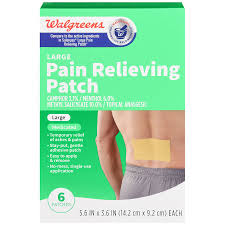
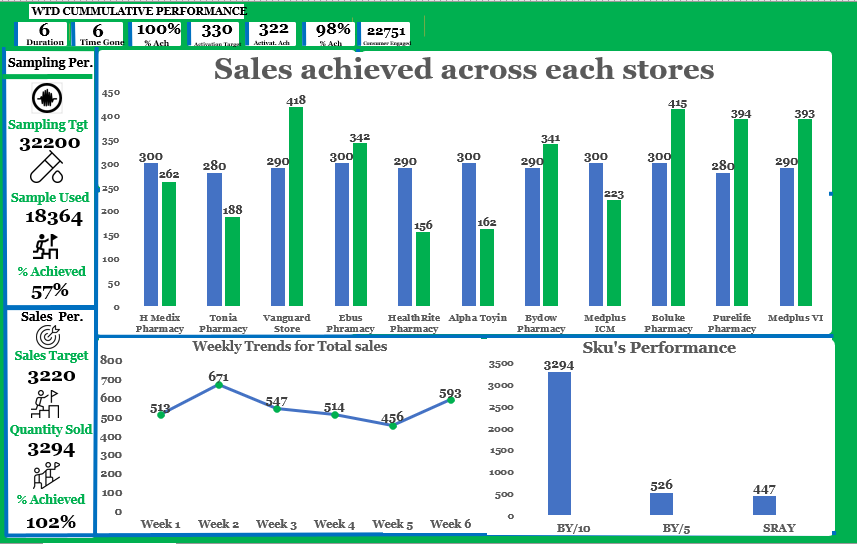
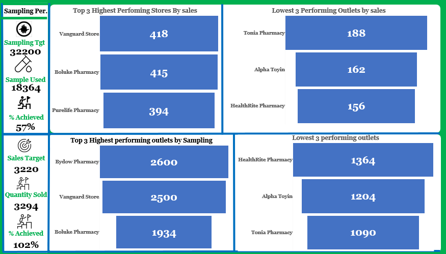

# Salonpas_InPharmacy_Dashboard

##**Introduction**
This Analysis provides an insight what appears to be a retail marketing campaign conducted across 11 pharmacy stores pan Nigeria. The report is designed to track two primary activities: **product sampling (distributing free samples to engage consumers) and product sales**. It visualizes performance against set targets, identifies trends over the campaign's duration, and highlights the best and worst-performing stores and products (SKUs).

##**Problem Statement**
The analysis seeks to answer critical business questions about the campaign's effectiveness:
1  Are we meeting our overall targets for product sampling and direct sales?
2  Which stores are the most and least effective at converting campaign activities into sales?
3  Is there a direct correlation between the number of samples distributed and the sales achieved in a given store?
4  What was the sales trend throughout the campaign period?
5  Which specific products (SKUs) are driving the majority of the sales?

#**Skills Demonstrated**
In Creating this analysis, some skills was demostrated, which are:
1  BI Tool Proficiency: Competent use of a business intelligence tool (like Power BI or Tableau) to create a multi-faceted report with interactive elements.
2  KPI Tracking: Identifying and prominently displaying key performance indicators (KPIs) for both sampling and sales, comparing actual performance against targets.
3  Comparative Analysis: Effectively using visuals to compare performance across different dimensions, such as store-vs-store, target-vs-actual, and sales-vs-sampling.
4  Data Visualization: Selecting appropriate chart types to represent the data, such as clustered column charts for target vs. actual, line charts for time-series trends, and horizontal bar charts for ranking.

##**Data Transformation**
Based on the visuals, the following data transformations were likely required:
Calculated Measures:
1  % Achieved was calculated for both sampling and sales using the formula: (Actual Value / Target Value).
2  The values in the Top 3 and Lowest 3 charts were likely generated by ranking stores based on aggregated sales and sampling data.
4  Data Aggregation: The raw transactional data (e.g., each individual sale or sample given) was aggregated by store, by week, and by SKU to populate the dashboard visuals.

##**Dimension Tables**:
1  A Stores Dimension with StoreID and StoreName (e.g., "Vanguard Store", "Tonia Pharmacy").
2  A Products Dimension with SKU_ID and SKU_Name (e.g., "BY/10").
3  A Date Dimension containing Date, WeekNumber, etc., to facilitate time-based analysis.
4  A Targets Dimension holding the SalesTarget and SamplingTgt for each store.
5  Relationships would link the StoreID, SKU_ID, and Date in the fact table to their respective dimension tables.

##**Analytics and Visualization**

The dashboard presents a clear, albeit mixed, performance story.

Home View Insights (Salon_home.PNG)

Overall Performance: The campaign is a success in terms of sales, having achieved 102% of its target (3294 units sold against a target of 3220). However, it is significantly underperforming in its sampling activity, having only used 57% of its target samples (18364 used out of 32200).

Store Performance (Sales): The "Sales achieved across each stores" chart shows a clear divide.

High Performers: Vanguard Store (418), Boluke Pharmacy (415), and Purelife Pharmacy (394) have significantly surpassed their sales targets (green bar is much taller than the blue bar).

Under-performers: Tonia Pharmacy (188), HealthRite Pharmacy (156), and Alpha Toyin (162) have missed their sales targets by a large margin.

Weekly Trend: Sales peaked in Week 2 (671) and then experienced a steady decline through Week 5 (456) before a slight recovery in the final week. This mid-campaign slump requires investigation.

SKU Performance: The BY/10 SKU is the undisputed star product, with 3294 units sold. This number seems to be the total quantity sold for all SKUs, suggesting BY/10 accounts for the vast majority, if not all, of the sales. Correction: The total quantity sold is 3294, and the bar for BY/10 also seems to indicate 3294. This is likely a labeling error where the total is mistakenly attributed to one SKU. Assuming the visual scale is correct, BY/10 sold approx. 3300 units, BY/5 sold 526, and SRAY sold 447. This makes BY/10 the dominant product.

Performance Ranking View (Salon_high.PNG)

Top/Lowest by Sales: This view confirms the findings from the home page, explicitly ranking Vanguard, Boluke, and Purelife as the top 3 stores for sales, and Tonia, Alpha Toyin, and HealthRite as the bottom 3.

Top/Lowest by Sampling: This provides a crucial comparative view.

Bydow Pharmacy is the #1 store for sampling (2600 samples) but is not in the top 3 for sales. This suggests their sampling efforts are not effectively converting to sales.

Vanguard Store is a top performer in both categories (#1 in Sales, #2 in Sampling), indicating a strong correlation between their sampling and sales activities.

HealthRite, Alpha Toyin, and Tonia Pharmacy are in the bottom 3 for both sampling and sales, indicating a general lack of performance or engagement in the campaign.

Feedback
Strengths:

Clear Objectives: The dashboard does an excellent job of separating and tracking the dual objectives of sampling and sales.

Ranking: The use of "Top 3" and "Lowest 3" views is highly effective for quickly identifying leaders and laggards.

Comparative Insight: The ability to compare top stores by sales versus top stores by sampling is the most powerful analytical feature of this dashboard.

Weaknesses / Areas for Improvement:

Confusing Top Banner: The "WTD CUMMULATIVE PERFORMANCE" banner is very confusing. The meaning of "330 % Ach," "322 Activ. Ach," and "98% % Ach" is unclear and lacks context. This section needs a complete redesign for clarity.

Contradictory Timeframe: The banner states "Duration: 6", while the trend chart is labeled by "Week." This creates ambiguity—is the report for 6 days or 6 weeks? This must be clarified.

Lack of Legends/Labels: The "Sales achieved across each stores" chart needs a legend to explicitly define the blue and green bars (e.g., Blue=Target, Green=Actual). The Y-axis should be labeled with units (e.g., "Quantity Sold").

Data Labeling Error: As noted in the SKU performance, it appears the total sales figure was mistakenly applied as a label to the top SKU, which could be misleading.

Recommendations
Dashboard Redesign: Immediately clarify the KPIs in the top banner and fix the "Days vs. Weeks" contradiction. Add legends and proper axis labels to all charts.

Investigate Under-performers: Conduct a deep dive into Tonia, Alpha Toyin, and HealthRite pharmacies. The issue could be low foot traffic, poor staff training on the campaign, or lack of execution.

Analyze Sampling Inefficiency: Find out why Bydow Pharmacy's high sampling activity did not translate into top-tier sales. Are they sampling the wrong customers? Is there a disconnect between sampling and the point of sale?

Replicate Success: Model the best practices from Vanguard Store, which excels at both sampling and sales conversion. Their strategy should be documented and shared with other stores.

Focus on Winning SKU: Since BY/10 is the dominant seller, ensure it is always in stock across all stores. Analyze why the other SKUs (BY/5, SRAY) are underperforming.

Address the Sales Slump: Investigate the cause of the sales decline from Week 3 to Week 5. Was there a drop in marketing efforts, a stock issue, or campaign fatigue?

Challenges
Data Ambiguity: The conflict between "6 days" and "6 weeks" is a significant challenge, as it fundamentally changes the interpretation of the sales velocity and trends.

Measuring ROI: The dashboard tracks activity and sales volume but lacks cost data. To understand the true success of the campaign, you need to analyze the Return on Investment (ROI) by factoring in the cost of samples given and the profit margin on units sold.

Correlation vs. Causation: The dashboard shows that high sampling doesn't always lead to high sales (e.g., Bydow). The challenge is to uncover the root cause, which requires qualitative data (e.g., staff interviews, customer feedback) beyond the scope of this dashboard.

